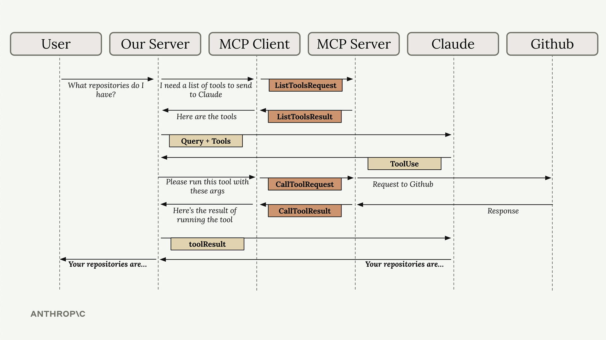

## MCP Client
The **MPC Client** provides communication between your server and a MCP server. The communication between the client and server can be done over many different ways.

For example, if you have MCP client and  MCP server on your same local machine then this communication done through `Standard IO`. They can also have capability to connect on `HTTP` or `Web Socket` etc..,

The **MCP Specifications** defines different types of messages that can be exchanges. For example:
- **ListToolRequest**: Gives a list of tools
- **ListToolResult**:Here are the tools can run
- **CallToolRequest**: Run a particular Tool with these arguments
- **CallToolResult**: Here is the result of Tool Run.

source: Anthropic Academy