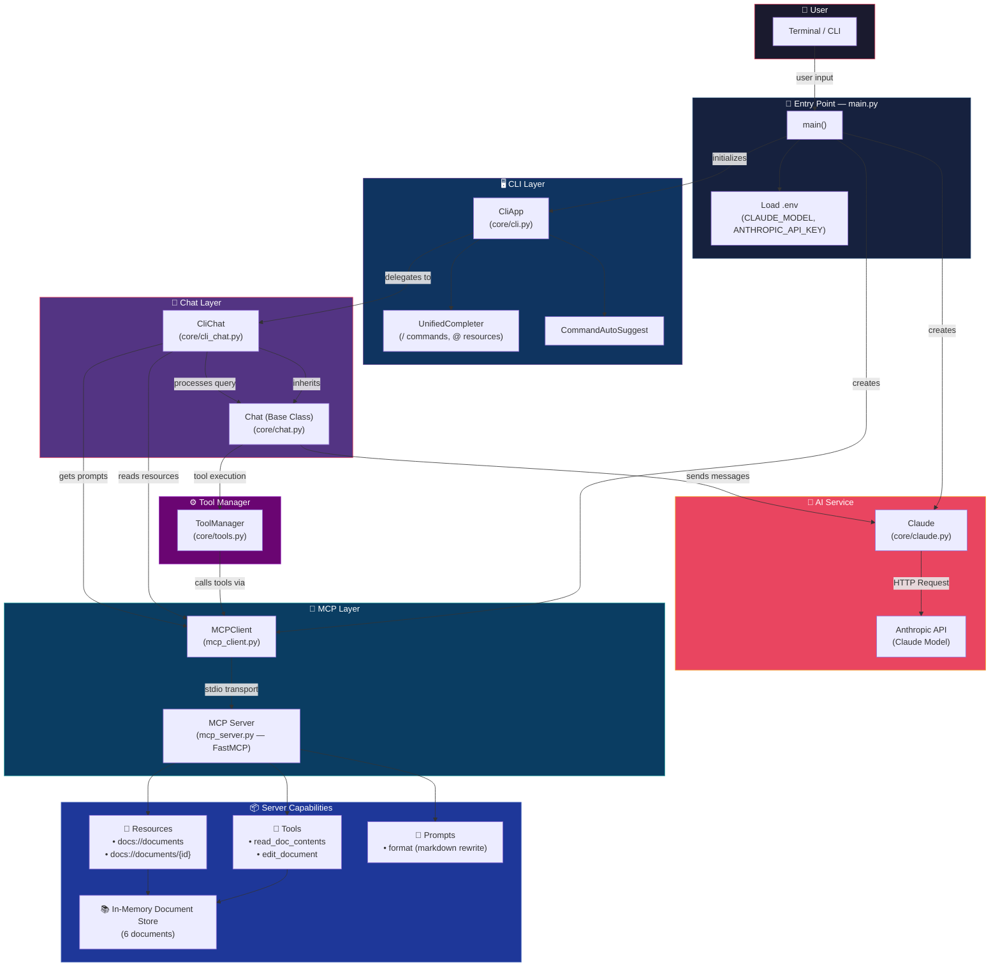
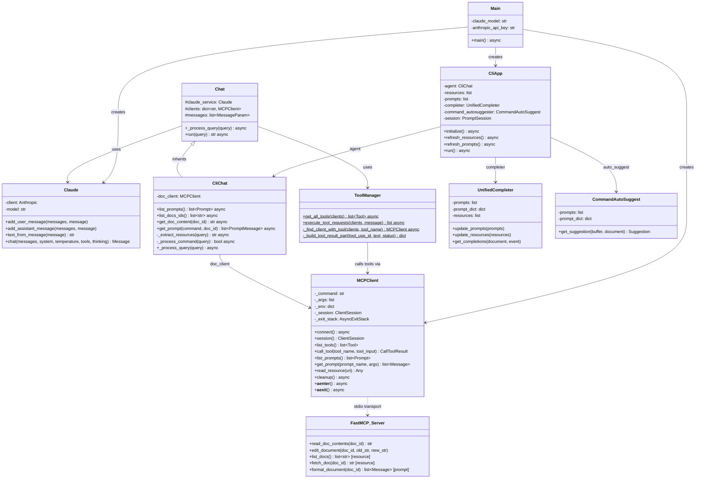
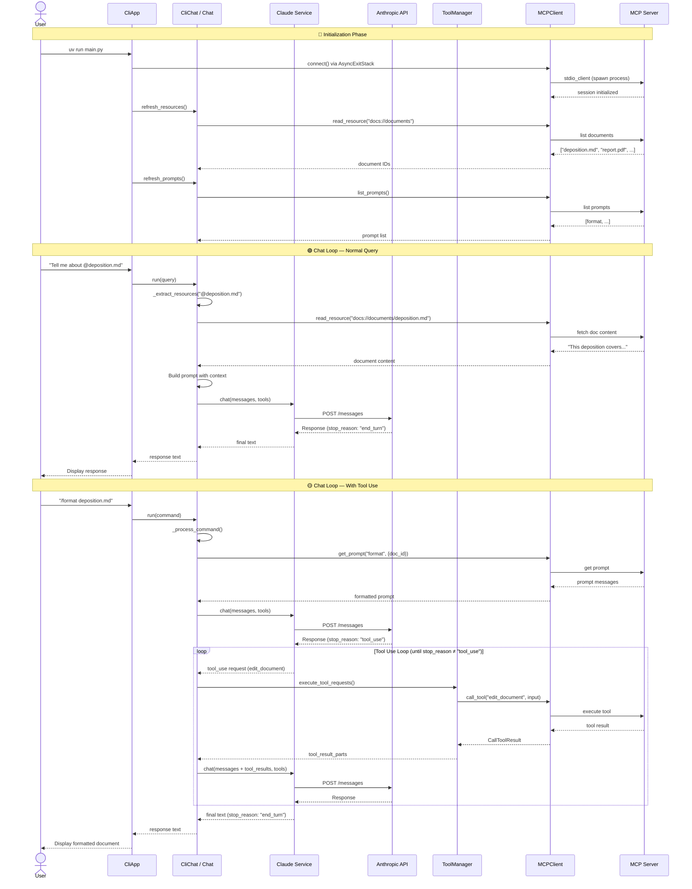

# Architecture Overview & Diagrams

This document provides a comprehensive overview of the architecture of the **clude-mcp-project**. It includes high-level architecture, class structures, and request-response flow diagrams designed using Mermaid.

---

## 1. High-Level Architecture

The system is structured as an interactive terminal CLI that communicates with a Claude AI Service. The AI Service can interactively execute tools and query resources hosted on an in-memory Model Context Protocol (MCP) Server via a secure stdio-based MCP Client connection.

---

## 2. Class Diagram

The class diagram maps the object-oriented structure of the CLI client, base chat service, and helper subsystems.

---

## 3. Request-Response Sequence Diagram

This sequence diagram displays the initialization sequence, resources load phase, direct chat query phase, and dynamic loop during tool execution request-response roundtrips.

