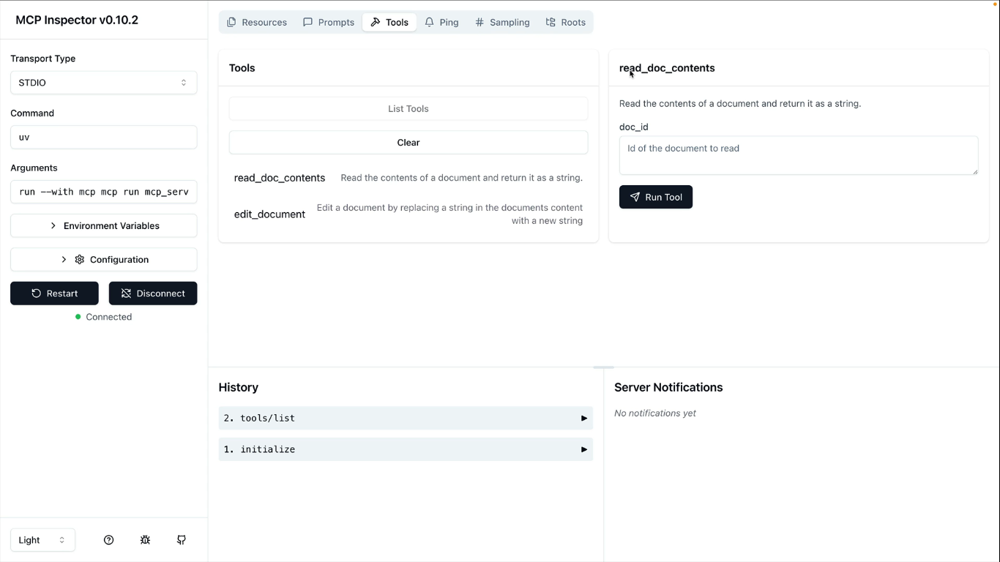

### How to run this project?
- Step 1:  Navigate 2-claude-mcp-project folder
- Step 2:  Run the command `uv run main.py`
- Step 3:  Type your message and press Enter to chat with the model.

---
### What does Server Inspector do?
It is a web application that allows you to interact with the MCP server and see the tools and resources etc.., that are available to the AI model.

### How to setup Mondel Context Inspector?
- Step 1: Activate the virtual environment
  - Run the command `.\.venv\Scripts\activate`
- Step 2: Navigate to `2_clude-mcp-project` folder
- Step 3: Run the command `uv run mcp dev mcp_server.py`
- Step 4: Open the URL shown in the terminal to access the MCP Inspector

### MCP Inspector Setup on the Window Machine
> NOTE: Due to some unknown reason, I am able to access to the UI on **Windows**. But when I click on the the `Connect` button it is not working. However, if you click on the `Connect` button you should see the UI like shown in the below image. 


> TODO: Change `npx @modelcontextprotocol/inspector` to different version and experiment it to fix this issue. I have tried with latest and npx `@modelcontextprotocol/inspector@0.10.2 uv run  mcp_server.py` but not working. I should also try by updating nodejs version.

### MCP Inspector Setup on the Ubuntu 24.04 machine
- Install the nodejs ([download](https://nodejs.org/en/download/current))
  ```shell
  # Download and install nvm:
  curl -o- https://raw.githubusercontent.com/nvm-sh/nvm/v0.40.6/install.sh | bash

  # in lieu of restarting the shell
  \. "$HOME/.nvm/nvm.sh"

  # Download and install Node.js:
  nvm install 26

  # Verify the Node.js version:
  node -v # Should print "v26.5.0".

  # Verify npm version:
  npm -v # Should print "11.17.0".
  ```

- Install uv ([offical Doc](https://docs.astral.sh/uv/getting-started/installation/)):
  ```shell
  curl -LsSf https://astral.sh/uv/install.sh | sh
  ```

- Add uv to the ~/.bashrc file so that you need to source everytime you open the termial.
  ```shell
  echo 'source "$HOME/.local/bin/env"' >> ~/.bashrc
  source ~/.bashrc
  ```

- Install the MCP Inspector CLI:
  ```shell
  npm install -g @modelcontextprotocol/inspector@latest
  ```

- Finally run the MCP Server:
  ```shell
  # Installs the packages
  uv sync

  # Starts the MCP server
  uv run mcp dev mcp_server.py
  ```

  Then open the URL that you got from running above command in the browser.

### Troubleshooting
- If you get `uv trampoline failed to canonicalize script path`, delete `.venv` and recreate it:

  ```
  Remove-Item -Recurse -Force .\.venv
  uv sync
  ```
- If `mcp` is not recognized, use `uv run` as prefix (e.g., `uv run mcp dev mcp_server.py`) or activate the venv first (`.\.venv\Scripts\activate`).

### Architecture Overview (Mermaid Diagrams)

The detailed architectural diagrams, including High-Level System Architecture, Class relationships, and Request-Response Sequence flows, have been moved to a separate document:

👉 **[Architecture Overview & Diagrams](architecture.md)**


