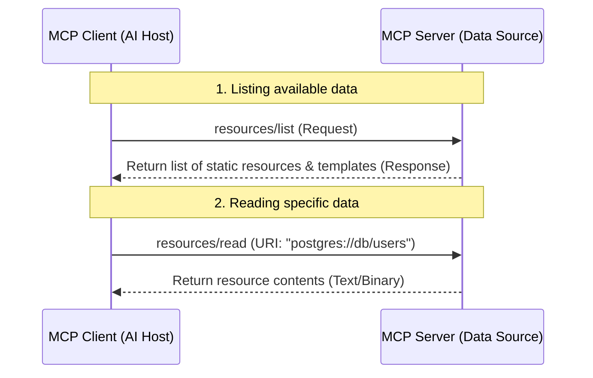
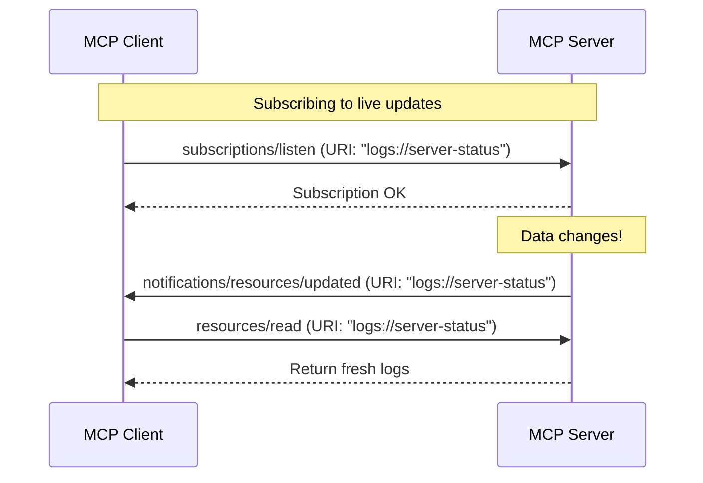

# 📦 Understanding MCP Resources: The Data Library for AI

## What are MCP Resources
Resources are read-only pieces of data or content that an MCP server exposes for the client (or the LLM app) to read — like files, database records, API responses, logs, config files, etc.

Think of a Resource as: **Here's some data you can look at.**

- Each resource has a **URI** (e.g. `file:///logs/app.log`, `postgres://db/customers/123`)
- The client application (like Claude Desktop) decides when to fetch it and hand it to the model as context
- Resources are typically passive — the server doesn't "do" anything, it just serves content when asked
- They're meant to be attached/injected into context, similar to how you'd attach a file to a conversation

## 🏠 The Library Analogy

Imagine your AI application is a **scholar** doing research, and the MCP Server is a **huge university library**.

In this library:
- **Resources** are the **Books, Documents, and Files** resting on the shelves. They contain raw information (text, code, databases, logs, or even images) that the scholar can read.
- **Resource URIs** are the **Call Numbers** (shelf locations) used to find a specific book. E.g., `library://history/rome-docs` or `file:///workspace/src/main.py`.
- **Tools** are the **Librarians** who can perform actions for you (e.g., search the system, rewrite a book, or run a query).
- **Prompts** are like **Recommended Reading Lists** or templates that guide the scholar on how to ask for books.

---

## ⚙️ Resources vs. Tools vs. Prompts

MCP servers expose three core features. Here is how Resources fit in:

| Feature | Primary Action | Behavior | Analogy | Example |
| :--- | :--- | :--- | :--- | :--- |
| **Resources** 📦 | **Read** | Passive data retrieval (safe, read-only) | Reading a book | Reading a log file or database table |
| **Tools** 🛠️ | **Execute** | Active actions that can modify state (requires user approval) | Asking a librarian to run a search | Saving a file or querying an API |
| **Prompts** 💬 | **Guide** | Templates that format user-AI instructions | A pre-filled inquiry form | "Analyze this code" prompt template |

---

## 📍 Key Concepts of Resources

### 1. Static vs. Dynamic Resources

Not all documents in our library are pre-printed and sitting on a shelf. Some are generated on the spot.

*   **Static Resources:** Real, fixed items.
    *   *Example:* A specific file on your computer (`file:///C:/project/README.md`) or a fixed API endpoint.
    *   *MCP method:* Listed via `resources/list`.
*   **Dynamic Resources (URI Templates):** Templates that generate a resource based on parameters you provide.
    *   *Example:* `database://{table_name}/schema` allows you to request the schema of *any* table dynamically.
    *   *MCP method:* Listed via `resources/templates/list`. Uses the RFC 6570 URI template standard.

### 2. URIs (Uniform Resource Identifiers)
Every single resource must have a unique URI. This serves as its global address within the MCP ecosystem.

*   **Standard URIs:**
    *   `file:///workspace/src/app.js` (Local files)
    *   `postgres://database/users` (Database tables)
*   **Custom URIs (Allowed & Encouraged!):**
    *   Yes, you can name the scheme and path **anything** you want! E.g., `madhu://files`, `my-app://users/profile`.
    *   Using a distinct, custom scheme (like `madhu://` instead of a generic `file://` or `db://`) is highly recommended to prevent namespace collisions if the client connects to multiple MCP servers at once.
    *   *Rule of thumb:* Make sure they follow valid URI syntax (starts with a letter, no spaces, uses lowercase, etc.).

### 3. MIME Types
To make sure the AI knows how to interpret the resource (e.g., is it plain text, JSON, or a binary image?), each resource is delivered with a **MIME Type**:
*   `text/plain` or `application/json` (Sent as text content)
*   `image/png` or `application/octet-stream` (Sent as base64-encoded binary content)

### 4. How URIs are Defined in Code (FastMCP Decorators)

In Python's FastMCP SDK, URIs are defined using the `@mcp.resource()` decorator. Let's look at the two patterns:

#### A. Static URIs
```python
@mcp.resource("docs://documents", mime_type="application/json")
def list_docs() -> list[str]:
    return list(docs.keys())
```
* **URI:** `"docs://documents"`
* **How it works:** This is a hardcoded, exact path. Whenever the client requests `"docs://documents"`, the server runs the `list_docs()` function and returns the list of all available document IDs in JSON format.

#### B. Dynamic URIs (URI Templates)
```python
@mcp.resource("docs://documents/{doc_id}", mime_type="text/plain")
def fetch_doc(doc_id: str) -> str:
    if doc_id not in docs:
        raise ValueError(f"Doc with id {doc_id} not found")
    return docs[doc_id]
```
* **URI Template:** `"docs://documents/{doc_id}"`
* **How it works:** `{doc_id}` is a placeholder (variable). 
* **Parameter Mapping:** If the client requests `"docs://documents/deposition.md"`, the server automatically:
  1. Matches it against the template pattern `"docs://documents/{doc_id}"`.
  2. Extracts `"deposition.md"` as the value for the `{doc_id}` placeholder.
  3. Automatically passes it as a keyword argument into the decorated function: `fetch_doc(doc_id="deposition.md")`.
  4. Returns the plain text content of that specific file.

---

## 🔔 Advanced Features: Stay Updated

Sometimes the resource is alive—like a real-time system log or a changing document. MCP provides two ways to track these changes:

### 1. Subscriptions (`subscriptions/listen`)
If the client wants to monitor a resource, it can "subscribe" to it.
When the resource's data changes, the server sends a **notification** (`notifications/resources/updated`), telling the client: *"Hey! The book was updated. Come read the new version."*

### 2. List Changed Notification (`notifications/resources/list_changed`)
If new files are added or deleted from the server, the server sends a list changed notification to let the client know it should refresh its catalog.

---

## 🔄 How it Works Under the Hood

### Reading a Resource


### Subscribing to Live Updates


---

## 🧠 Q&A

### ❓ Is a resource safe for the AI to read without user permission?
Yes! Since resources are strictly **read-only**, reading them doesn't modify code, send emails, or run commands. Therefore, clients typically allow models to read resources automatically without prompting the user for approval (unlike Tools, which can be destructive or perform actions and require explicit confirmation).

### ❓ Can a resource return binary data like images?
Yes! The MCP spec supports binary content. The server encodes the file in base64 and returns it under a binary block, alongside its MIME type (e.g., `image/png`).

> [!TIP]
> When building an MCP server, use **URI Templates** (`templates/list`) when you have data that changes based on input parameters (e.g., user IDs, repository names, or specific dates), rather than trying to list thousands of static resources upfront!
